# Description

The project within this directory aims at evaluating three non linear models for their capability to identify age related biomarkers by inferring age and explaining the models using the [SHAP](https://shap.readthedocs.io/en/latest/overviews.html) framework for explaining AI models.  
The evaluated models were the [lightGBM](https://lightgbm.readthedocs.io/en/stable/) gradient boosted desition tree, the [ACE](https://github.com/suinleelab/ACE) variational autoencoder developed by the Sun Lee Lab and a simple linear classifier.  
The pipeline further emits the top 50 feature attribution in csv format for each model, outputs some data summary statistics and model parameters and even gene- gene interactions.
The snakmake pipline includes hyperparameter optimisaiton for lightGBM and the linear model while for the VAE the default parameters were used, model training and identifying the most informative features as judged by each model. Finally three venn diagrams visualize the overlap of the top 50 features of each model for mice aged 3, 16 and 24 months. 
As training data a small, publicly accessible subset of the [tabula muris senis](https://tabula-muris-senis.sf.czbiohub.org/) single cell sequencing data set was used.  

# Basic usage
The pipeline is currently set up to analyse a dataset containing specifically three age groups, namely 3, 18 and 24 months and is thus not capable to generalize without modification.   

# Results

## ACE 
The ACE model generates embeddings for Age (3D) and for Background (17D) with a loss function optimized for disentangeling the relationships of features to age and other covariates such as batch, cell type etc. The following plots show UMAPS of the initial features and the subsequent age- embeddings for the variables age, sex, cell type and tissue type:  
  
UMAPS of native features
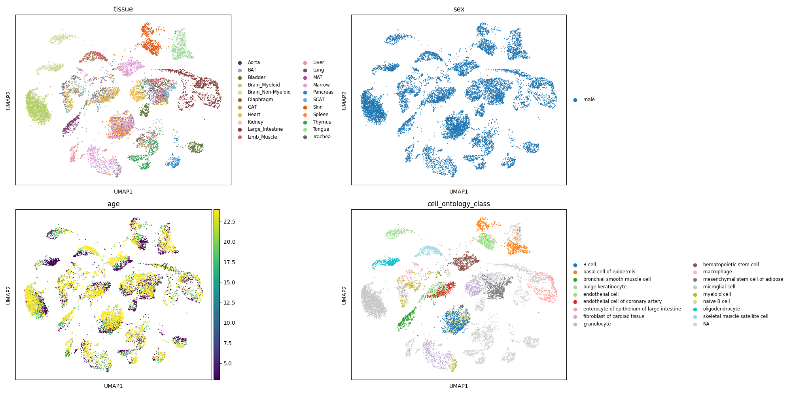 
  
UMAPS of Age- embeddings 
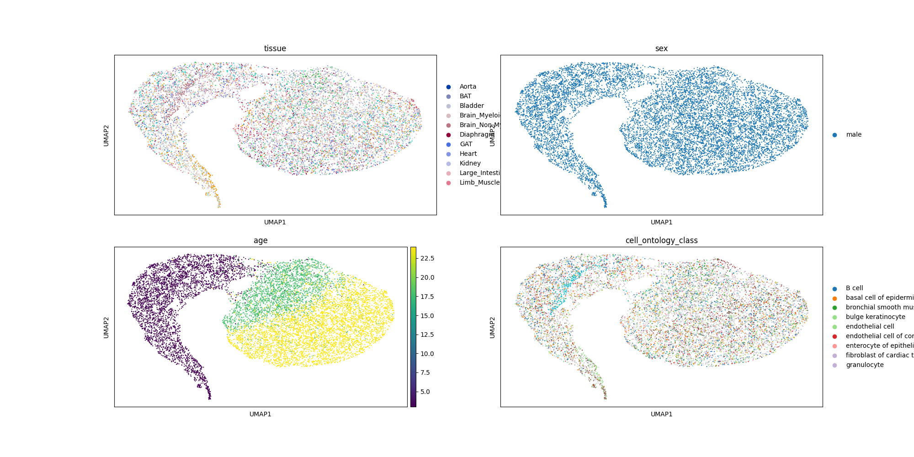

The following plots depict the 10 most important features for the age groups 3, 18 and 24 months and their interaction partners:
  
Mice aged 3 months:
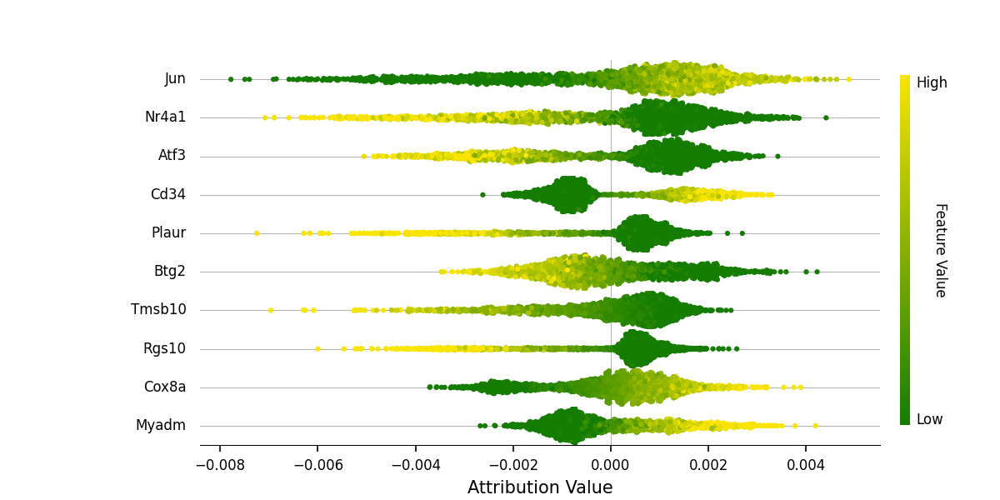 
  
Mice aged 18 months:
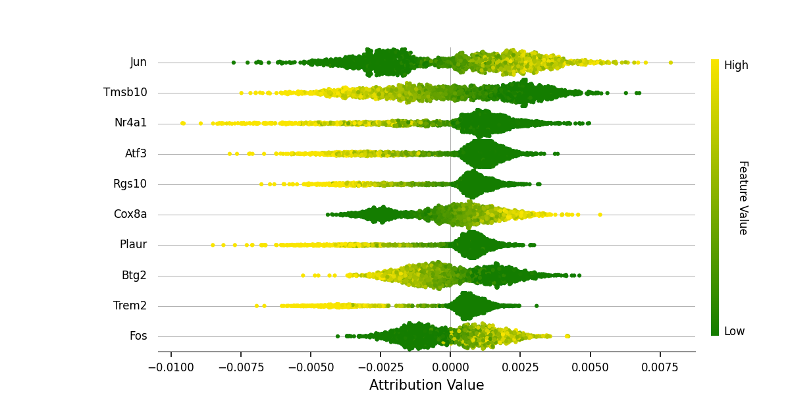
  
Mice aged 24 months:
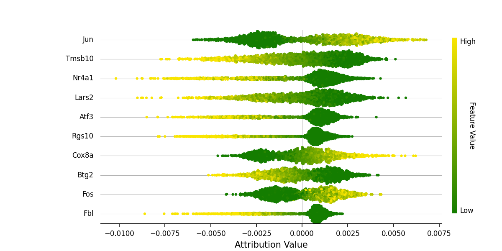

## lightGBM
The following plots show the top 10 feature attributions of the lightGBM model.

Mice aged 3 months:
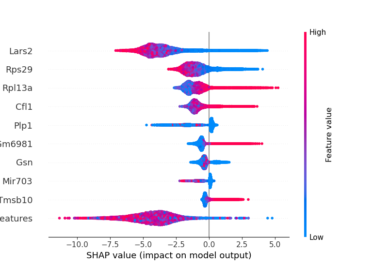 
  
Mice aged 18 months:
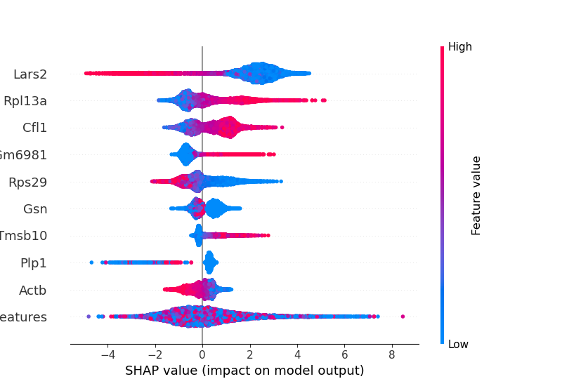
  
Mice aged 24 months:
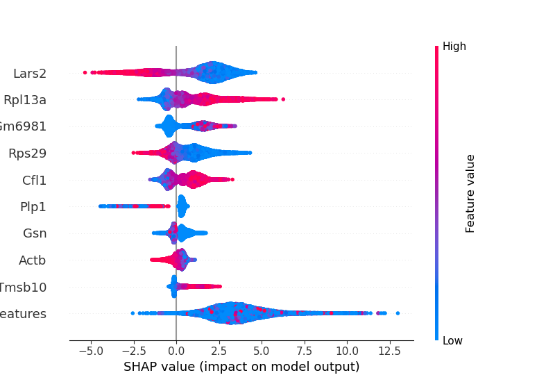

## Overall comparison
The following venn diagrams depict the overlap in top 50 features used by each of the three models for each of the three age groups:

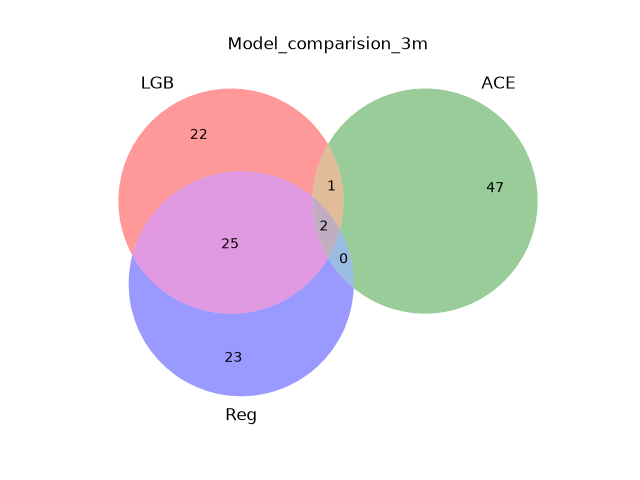 
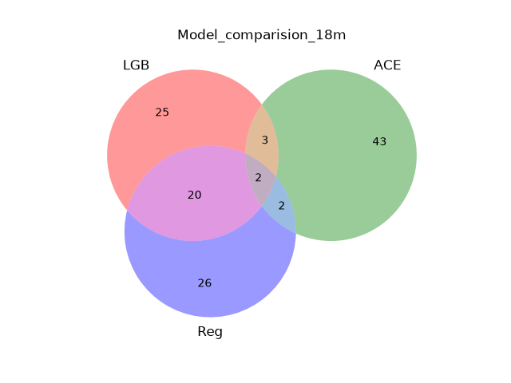
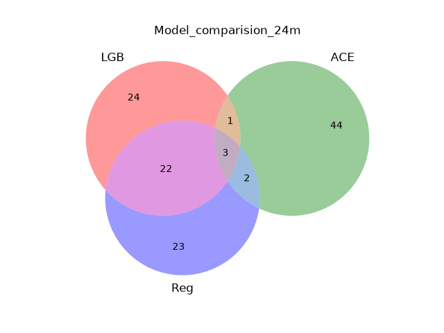
